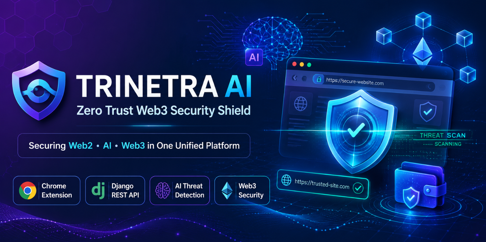
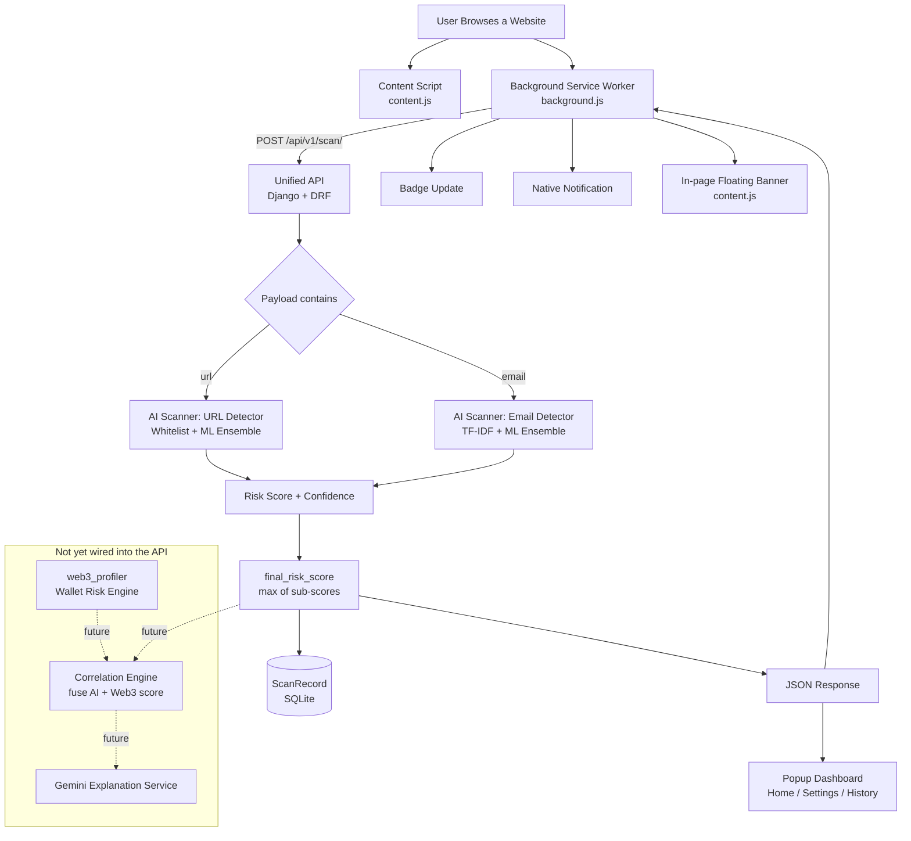
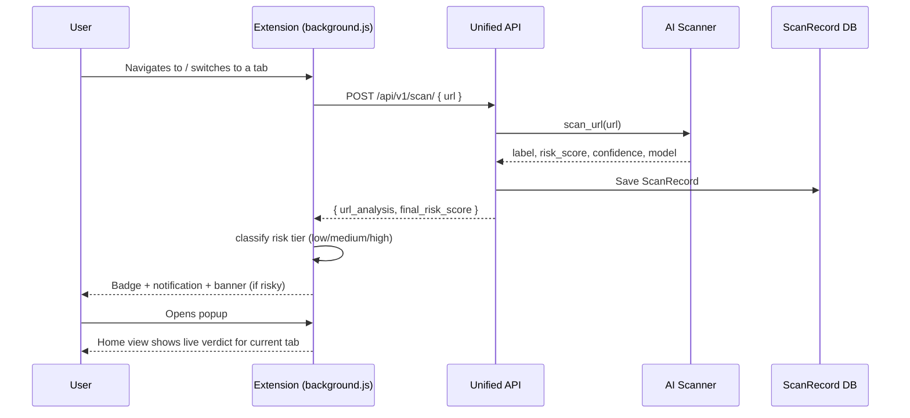
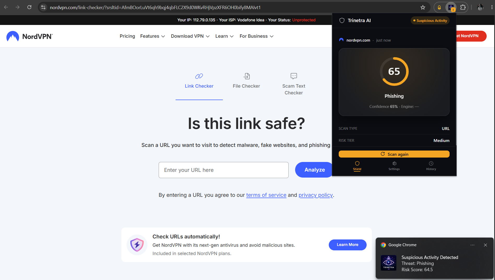
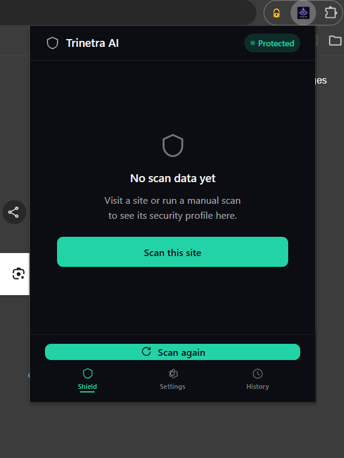
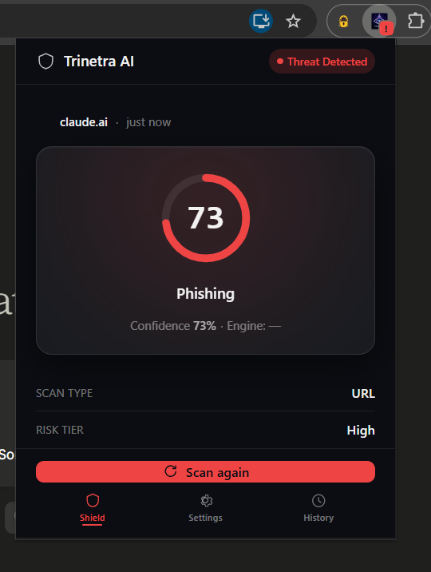
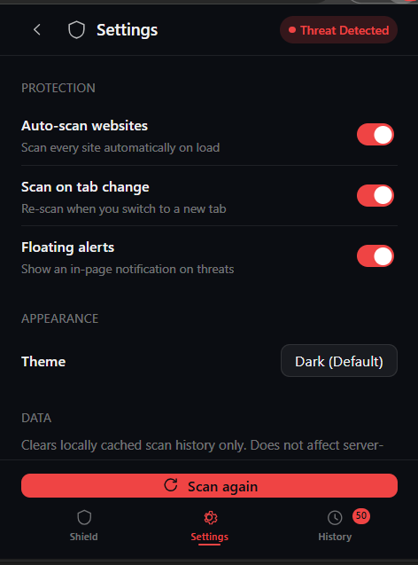
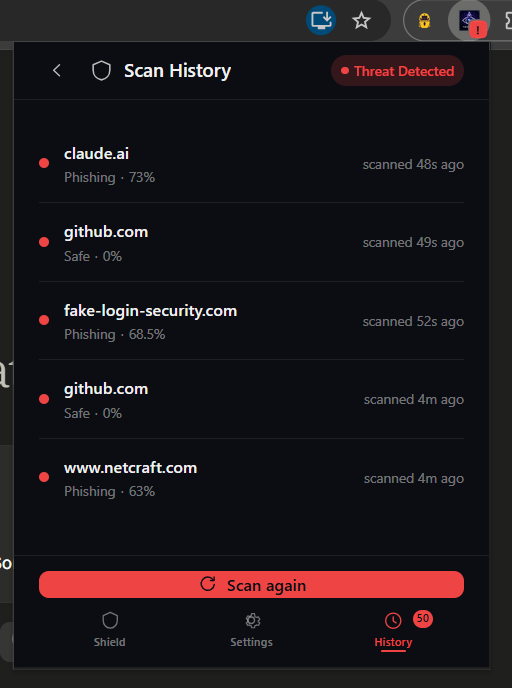
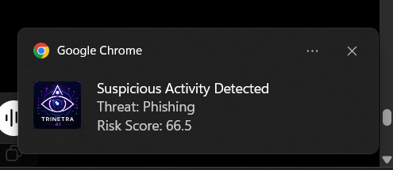

<div align="center">



<br>

<h1>🛡️ TRINETRA AI</h1>
<h3>Zero Trust Web3 Security Shield</h3>

<p>
  
  
  
  
  
  
</p>

<br/>


</div>

---

## 📌 Overview

**Trinetra AI** is a Zero Trust browser security system that watches every page you visit and — where a wallet address is involved — every address you're about to interact with, instead of trusting a site just because it *looks* legitimate.

It combines three layers of evidence:

- **Web2 signals** — is the URL itself lexically suspicious, or is it a known‑safe domain?
- **AI signals** — what does a trained phishing‑classification model say about the URL / email content?
- **Web3 signals** — is the on‑chain address a verified contract, an unverified "drainer‑shaped" contract, or a fresh burner wallet?

No single signal is trustworthy on its own — a URL can look clean while the wallet behind it is brand new, and vice versa. Trinetra AI exists to close that gap by evaluating Web2 and Web3 risk side by side rather than in isolation.

The system ships as a **Chrome Extension** (real‑time capture + alerting) backed by a **Django REST API** (AI scanning + persistence).

---

## ✨ Features

### 🔌 Chrome Extension (Manifest V3)
| | Feature | Details |
|---|---|---|
| 🔍 | Automatic scanning | Every URL navigation and tab switch is sent to the backend for scoring |
| 🧭 | Single‑screen popup | Home (live verdict + risk ring), Settings, and Scan History views in one popup |
| 🎯 | Manual scan | On‑demand scan trigger from the popup, independent of auto‑scan |
| 🚦 | Badge alerts | Extension icon badge turns amber/red on medium/high risk tabs |
| 🔔 | Dual notifications | Native OS notification **and** an in‑page floating banner (each independently toggleable) |
| ⚙️ | Configurable settings | Auto‑scan, scan‑on‑tab‑change, and floating alerts, all synced live via `chrome.storage` |
| 🕒 | Local scan history | Last 50 scans cached client‑side, viewable per‑site or as a full list |

### 🖥️ Backend (Django + DRF)
| | Feature | Details |
|---|---|---|
| 🔗 | Unified scan endpoint | One `POST` request accepts a URL, an email, or both, and returns a combined verdict |
| 🗃️ | Scan history persistence | Every scan (email/URL/wallet/website) is stored as a `ScanRecord` for auditability |
| 🌐 | CORS‑aware | Configured so the `chrome-extension://` origin can call the API |
| 🛑 | Rate limiting | Anonymous requests throttled to 60/min to protect downstream AI/API costs |
| 📖 | API schema | `drf-spectacular` included for OpenAPI schema generation |

### 🧠 AI Analysis
| | Feature | Details |
|---|---|---|
| 🌐 | URL Detector | Trusted‑domain whitelist check, then an ML ensemble (Decision Tree / Logistic Regression / Random Forest + scaler + TF‑IDF) predicts phishing risk for anything not whitelisted |
| ✉️ | Email / Phishing Detector | TF‑IDF vectorization + the same DT/LR/RF ensemble, trained on a phishing‑email dataset, returns label, risk score, confidence, model used, and an explanation |
| 🧩 | Detector Registry | New detectors register themselves in one place (`ai_scanner/registry.py`) with no changes needed to the routing layer |

### 🪙 Web3 Risk Engine
| | Feature | Details |
|---|---|---|
| ✅ | Address validation | Checksum validation via `web3.py` |
| 🕵️ | EOA vs. Contract detection | Distinguishes a plain wallet from a deployed smart contract by inspecting on‑chain bytecode |
| 🧊 | Burner‑wallet heuristic | Flags zero‑balance / freshly created wallets as high risk for phishing collection points |
| 🔎 | Contract verification check | Cross‑references Etherscan to flag **unverified** contracts (a common drainer pattern) as critical risk |
| 🗄️ | Wallet profile storage | `WalletProfile` model persists an address's last known risk score and status |

> **Note on current wiring:** the Web3 risk engine (`web3_profiler`) is implemented and independently testable, but its API route is not yet mounted on the main URL router, so wallet scans aren't reachable through `/api/` today — this is the top item in [Roadmap](#-roadmap--in-progress).

---

## 🧱 System Architecture



### Components

- **Chrome Extension** (`frontend_extension/`) — service worker, content script, and popup UI. The only part of the stack the browser directly touches.
- **Unified API** (`unified_api/`) — the single Django app the extension talks to: request handling, response shaping, and scan persistence.
- **AI Scanner** (`ai_scanner/`) — self‑contained detector packages (`url_detector/`, `email_detector/`), each with its own trained models, feature extraction, and service layer.
- **Web3 Profiler** (`web3_profiler/`) — on‑chain wallet/contract risk evaluation, currently standalone.
- **Core Project** (`Trinetra_Ai_Core/`) — Django settings, root URL config, WSGI/ASGI entry points.

---

## 🔄 Workflow



1. The user navigates to or switches into a tab.
2. `background.js` sends the tab URL to `POST /api/v1/scan/`.
3. The Unified API runs the whitelist check, then the URL detector's ML ensemble if the domain isn't pre‑trusted.
4. The response (`label`, `risk_score`, `confidence`, `final_risk_score`) is stored as a `ScanRecord` and returned to the extension.
5. The extension caches the result locally, updates the toolbar badge, and — if the score crosses the medium/high threshold and the corresponding setting is on — fires a native notification and an in‑page banner.
6. Opening the popup shows the cached verdict for the active tab, with **Settings** and **Scan History** one tap away.

Email scans follow the same path through `scan_email()` and can be combined with a URL in a single request; the API returns a `final_risk_score` that is the **maximum** of whichever sub‑scores were computed.

---

## 📂 Project Structure

```
Trinetra-Ai/
├── Trinetra_Ai_Core/           # Django project: settings, root urls, WSGI/ASGI
│   ├── settings.py
│   ├── urls.py
│   ├── wsgi.py
│   └── asgi.py
│
├── unified_api/                 # The API the extension talks to
│   ├── models.py                 # ScanRecord
│   ├── serializers.py
│   ├── views.py                  # ScanView, ScanHistoryView
│   ├── urls.py                   # /v1/scan/, /v1/history/
│   ├── services/
│   │   ├── gemini_service.py     # Gemini explanation generator (not yet called by views)
│   │   ├── correlation_engine.py # Threat correlation engine (stub / future fusion layer)
│   │   └── audit.py              # Audit/SIEM-style scan logging helper
│   └── migrations/
│
├── ai_scanner/                   # AI detection engines
│   ├── registry.py               # Pluggable detector registry
│   ├── logic.py                  # AI gateway (routes to the right detector)
│   ├── shared/                   # Shared logger, exceptions, response schema
│   ├── url_detector/
│   │   ├── predictor.py
│   │   ├── feature_extractor.py
│   │   ├── models/                # Trained DT / LR / RF / scaler / TF-IDF pickles
│   │   └── dataset.csv
│   ├── email_detector/
│   │   ├── predictor.py
│   │   ├── feature_extractor.py
│   │   ├── models/                # Trained DT / LR / RF / TF-IDF pickles
│   │   └── datasets/phishing_email_dataset.csv
│   └── website_detector/         # dom_analyzer.py, html_analyzer.py — scaffolded, not implemented yet
│
├── web3_profiler/                # On-chain wallet/contract risk engine
│   ├── logic.py                  # evaluate_web3_address()
│   ├── models.py                 # WalletProfile
│   ├── views.py / urls.py        # present but not mounted on the root router yet
│   └── migrations/
│
├── frontend_extension/           # Chrome Extension (Manifest V3)
│   ├── manifest.json
│   ├── background.js             # Service worker: scanning, notifications, badges
│   ├── content.js                # In-page floating alert banner
│   ├── popup.html / popup.css / popup.js
│   └── icons/
│
├── Doc/
│   └── email_detector.md         # Email detection engine design notes
│
├── manage.py
├── requirements.txt
├── structure.txt
├── db.sqlite3                    # Default local dev database (SQLite)
└── Readme.md
```

---

## 🛠️ Technology Stack

<table>
<tr><td valign="top"><b>Extension</b></td><td>

- HTML5, CSS3, vanilla JavaScript
- Chrome Extension APIs (Manifest V3): `storage`, `tabs`, `notifications`, `activeTab`, service worker

</td></tr>
<tr><td valign="top"><b>Backend</b></td><td>

- Python, Django 6, Django REST Framework
- `django-cors-headers`, `django-environ`, `drf-spectacular`
- Gunicorn (production WSGI server)
- SQLite (default dev DB) — `psycopg[binary]` included for a Postgres upgrade path

</td></tr>
<tr><td valign="top"><b>AI / ML</b></td><td>

- scikit-learn (Decision Tree, Logistic Regression, Random Forest)
- pandas, numpy, joblib (model persistence), TF-IDF vectorization

</td></tr>
<tr><td valign="top"><b>Web3</b></td><td>

- `web3.py`, `eth-account`, `eth-utils`
- Alchemy RPC provider + Etherscan API for contract verification lookups

</td></tr>
<tr><td valign="top"><b>Generative AI</b></td><td>

- Google Gemini (`google-generativeai` / `google-genai`) — plain-English risk explanations (service implemented, not yet called from the live scan pipeline)

</td></tr>
<tr><td valign="top"><b>Testing / Ops</b></td><td>

- pytest
- prometheus-client (metrics scaffold)

</td></tr>
</table>

---

## ⚙️ Installation & Setup

### 🔹 Clone the repository

```bash
git clone https://github.com/Ayushmishra9793/Trinetra-Ai.git
cd Trinetra-Ai
```

### 🔹 Backend setup

```bash
# 1. Create and activate a virtual environment
python -m venv venv
source venv/bin/activate        # Windows: venv\Scripts\activate

# 2. Install dependencies
pip install -r requirements.txt

# 3. Configure environment variables
# Create a .env file in the project root:
#   GEMINI_API_KEY=your_gemini_api_key        # required only if you enable AI explanations
#   ALCHEMY_URL=your_alchemy_rpc_url           # required to use the Web3 risk engine
#   ETHERSCAN_API_KEY=your_etherscan_api_key   # required to use the Web3 risk engine

# 4. Apply migrations
python manage.py migrate

# 5. Run the development server
python manage.py runserver
```

By default the API is served at `http://127.0.0.1:8000/`, which matches the `host_permissions` already declared in the extension's `manifest.json`.

### 🔹 Chrome Extension setup

1. Open **Chrome → Extensions** (`chrome://extensions`)
2. Enable **Developer Mode** (top‑right toggle)
3. Click **Load Unpacked**
4. Select the `frontend_extension/` folder
5. Pin the Trinetra AI icon to your toolbar

> If you enable CORS restrictions in production, add your loaded extension's `chrome-extension://<id>` origin to `CORS_ALLOWED_ORIGINS` in `Trinetra_Ai_Core/settings.py`.

---

## 📡 API Overview

Base path: `/api/`

### `POST /api/v1/scan/`

Runs a unified scan. Accepts a `url`, an `email`, or both in the same request.

**Request**
```json
{
  "url": "http://suspicious-login-example.com/verify"
}
```

**Response**
```json
{
  "url_analysis": {
    "label": "Phishing",
    "risk_score": 82.4,
    "confidence": 91.2
  },
  "final_risk_score": 82.4
}
```

If an `email` field is also supplied, the response additionally includes an `email_analysis` object (`label`, `risk_score`, `confidence`, `model`, `explanation`, `metadata`), and `final_risk_score` becomes the maximum of the URL and email risk scores.

### `GET /api/v1/history/`

Returns every stored `ScanRecord`, most recent first.

**Response**
```json
[
  {
    "id": 14,
    "scan_type": "url",
    "input_data": "http://suspicious-login-example.com/verify",
    "verdict": "Phishing",
    "risk_score": 82.4,
    "confidence": 91.2,
    "model_used": "RandomForest",
    "explanation": "",
    "metadata": {},
    "created_at": "2026-07-15T10:22:31Z"
  }
]
```

---

## 🖼️ Screenshots

### Extension Overview



*Trinetra AI actively monitors websites and instantly alerts users about suspicious activity.*

---

### Home Screen



*Home dashboard of the Chrome Extension.*

---

### Threat Detection



*Real-time phishing detection with risk score visualization.*

---

### Settings



*Configure automatic scanning, notifications and extension behavior.*

---

### Scan History



*Review previously scanned websites along with their security verdicts.*

---

### Browser Notification



*Native Chrome notification displayed immediately after a suspicious website is detected.*

## 👥 Contributors

<table>
<tr><th>Name</th><th>Role</th><th>Responsibilities</th></tr>
<tr>
<td><b>Ayush Mishra</b></td>
<td>Backend Developer</td>
<td>Django backend, REST APIs, scan pipeline, unified API architecture, AI integration, database</td>
</tr>
<tr>
<td><b>Khyati Agrawal</b></td>
<td>Chrome Extension Frontend Developer</td>
<td>Extension UI, popup interface, settings, scan history, background communication, content script, notifications, extension architecture, frontend integration</td>
</tr>
<tr>
<td><b>S. P. Vishvakarma</b></td>
<td>Web3 Developer</td>
<td>Web3 integration, wallet analysis, blockchain security, Web3 risk engine</td>
</tr>
<tr>
<td><b>Yashendra</b></td>
<td>Web2 Security Developer</td>
<td>URL detection, website analysis, threat detection, Web2 security logic</td>
</tr>
</table>

---

## 🧭 Roadmap / In Progress

- Mount `web3_profiler`'s scan route on the main API router so wallet/contract checks are reachable via `/api/`
- Wire the **Correlation Engine** to fuse AI (URL/email) and Web3 wallet scores into one unified verdict
- Call the **Gemini explanation service** from the live scan pipeline to turn risky verdicts into a plain‑English warning
- Implement the **website/DOM analyzer** (`ai_scanner/website_detector/`) for full‑page content analysis, not just URL/email
- Move from SQLite to Postgres for production deployments (dependencies already included)
- Cross‑browser support beyond Chrome

---

## 📜 License

This project is licensed under the **MIT License**.

---

## 🙏 Acknowledgements

- [scikit-learn](https://scikit-learn.org/) for the phishing classification models
- [web3.py](https://web3py.readthedocs.io/) and [Etherscan](https://etherscan.io/) for on-chain verification
- [Google Gemini](https://ai.google.dev/) for plain-English risk explanations
- [Django REST Framework](https://www.django-rest-framework.org/) for the API layer

---

<div align="center">
<h3>🔥 "Trinetra AI – See Beyond Threats."</h3>
</div>