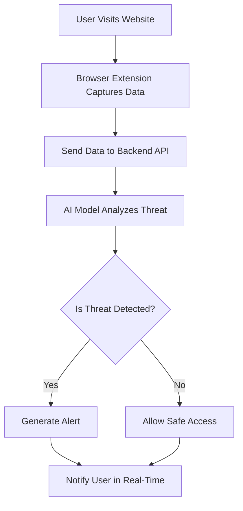

<div align="center">

<h1>🚀 TRINETRA AI</h1>

<h3>AI-Powered Cyber Intelligence Platform</h3>

<p>
  
  
  
</p>

<h4>🎨 Project Banner</h4>

<p><i>Add your banner image here</i></p>

</div>

---

<h2>📌 Overview</h2>

<p>
<b>Trinetra AI</b> is an advanced cybersecurity platform that leverages
<mark><b>Artificial Intelligence</b></mark>, <mark><b>Web3</b></mark>, and
<mark><b>Browser Extension</b></mark> technologies to detect and prevent
malicious activities in real-time.
</p>

<p>
The system acts as a <b>digital guardian</b>, continuously monitoring user
interactions, analyzing threats, and providing <b>instant alerts</b> to
ensure safe browsing.
</p>

---

<h2>✨ Key Features</h2>

<table>
<tr><td>🔍</td><td><b>AI-Based Threat Detection</b></td><td>Intelligent analysis of suspicious behavior</td></tr>
<tr><td>🌐</td><td><b>Real-Time Browser Monitoring</b></td><td>Detect threats while browsing</td></tr>
<tr><td>🔗</td><td><b>Web3 Security Integration</b></td><td>Enhanced decentralized security layer</td></tr>
<tr><td>⚡</td><td><b>Instant Alerts & Notifications</b></td><td>Immediate response to threats</td></tr>
<tr><td>🧠</td><td><b>Smart Decision Engine</b></td><td>AI-driven classification of risks</td></tr>
<tr><td>📊</td><td><b>Dashboard Insights</b></td><td>Visual representation of threats</td></tr>
</table>

---

<h2>🧱 System Architecture</h2>

<p><i>Add your architecture diagram image here</i></p>

<h3>🔹 Components</h3>

<ul>
  <li><b>Frontend (Web2)</b> — User interface and dashboard</li>
  <li><b>Backend</b> — API handling, AI processing, data analysis</li>
  <li><b>Web3 Layer</b> — Blockchain-based validation & security</li>
  <li><b>Browser Extension</b> — Real-time monitoring and alerts</li>
  <li><b>External APIs</b> — Threat intelligence sources</li>
</ul>

---

<h2>🔄 Workflow</h2>



<h3>🔹 Step-by-Step Flow</h3>

<ol>
  <li>User visits a website</li>
  <li>Extension captures browsing activity</li>
  <li>Data is sent to backend server</li>
  <li>AI model processes and analyzes risk</li>
  <li>System determines if threat exists</li>
  <li><b>User receives instant alert</b></li>
</ol>

---

<h2>🛠️ Tech Stack</h2>

<h3>🔹 Frontend</h3>
<p>


</p>

<h3>🔹 Backend</h3>
<p>


</p>

<h3>🔹 AI/ML</h3>
<p>


</p>

<h3>🔹 Web3</h3>
<p>


</p>

<h3>🔹 Extension</h3>
<p>

</p>

---

<h2>📂 Project Structure</h2>

```
Trinetra-AI/
│── frontend/        # Web UI (Web2)
│── backend/         # API & AI logic
│── web3/            # Blockchain integration
│── extension/       # Browser extension
│── docs/            # Documentation & assets
│── README.md
```

---

<h2>⚙️ Installation & Setup</h2>

<h3>🔹 Clone Repository</h3>

```bash
git clone https://github.com/Ayushmishra9793/Trinetra-Ai.git
cd Trinetra-Ai
```

<h3>🔹 Backend Setup</h3>

```bash
cd backend
npm install
npm start
```

<h3>🔹 Frontend Setup</h3>

```bash
cd frontend
npm install
npm start
```

<h3>🔹 Extension Setup</h3>

<ol>
  <li>Open <b>Chrome → Extensions</b></li>
  <li>Enable <b>Developer Mode</b></li>
  <li>Click <b>"Load Unpacked"</b></li>
  <li>Select the <code>extension/</code> folder</li>
</ol>

---

<h2>🚀 Usage</h2>

<ol>
  <li>Start backend server</li>
  <li>Launch frontend dashboard</li>
  <li>Enable browser extension</li>
  <li>Visit any website</li>
  <li><b>Get real-time threat analysis</b></li>
</ol>

---

<h2>📊 Use Cases</h2>

<ul>
  <li>🛡️ <b>Phishing detection</b></li>
  <li>🔐 <b>Secure browsing</b></li>
  <li>🌍 <b>Enterprise cybersecurity</b></li>
  <li>👨‍💻 <b>Developer security tools</b></li>
</ul>

---

<h2>🎥 Demo</h2>

<p><i>Add your demo video or GIF here</i></p>

---

<h2>🧠 Future Scope</h2>

<ul>
  <li>📱 Mobile application</li>
  <li>🤖 Advanced AI models</li>
  <li>🏢 Enterprise-grade solutions</li>
  <li>🌐 Cross-browser support</li>
</ul>

---

<h2>👨‍💻 Team</h2>

<table>
<tr><th>Name</th><th>Role</th></tr>
<tr><td><b>Ayush Mishra</b></td><td>Backend Developer</td></tr>
<tr><td><b>Yashendra Kumar</b></td><td>Web2 Developer</td></tr>
<tr><td><b>Pritam</b></td><td>Web3 Developer</td></tr>
<tr><td><b>Khyati Agrawal</b></td><td>Browser Extension Developer</td></tr>
</table>

---

<h2>🤝 Contributing</h2>

<p>Contributions are welcome! 🎉</p>

```bash
# Fork the repo
# Create a new branch
git checkout -b feature/your-feature

# Commit your changes
git commit -m "Add some feature"

# Push and submit a Pull Request
git push origin feature/your-feature
```

---

<h2>📜 License</h2>

<p>This project is licensed under the <b>MIT License</b>.</p>

---

<h2>⭐ Support</h2>

<p>If you like this project, give it a ⭐ on <b>GitHub</b>!</p>

---

<h2>📬 Contact</h2>

<p>For queries or collaboration: 📧 <i>Add your email here</i></p>

---

<div align="center">

<h2>🔥 "Trinetra AI – See Beyond Threats."</h2>

</div>