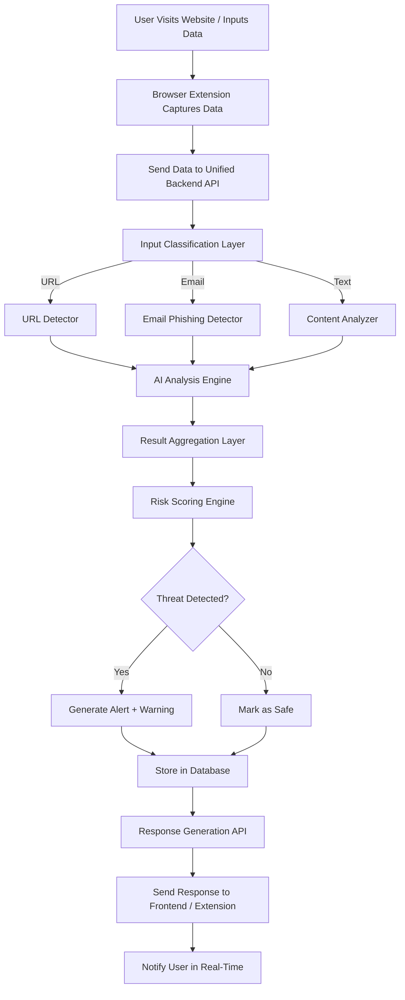

<div align="center">

# 🛡️ TRINETRA AI

### Real-Time AI-Powered Cyber Threat Detection & Protection

<p align="center">
  
</p>

[](LICENSE)
[]()
[]()

</div>

---

## 🚀 Overview

**TRINETRA AI** is an intelligent cybersecurity system designed to detect malicious threats in real time. It analyzes **URLs, emails, and text content** using AI models and provides instant risk assessment to protect users from phishing, scams, and harmful content.

> 🎯 Built for hackathons with scalability, real-world usability, and AI innovation in mind.

---

## ✨ Key Features

| Feature | Description |
|---|---|
| 🔍 URL Threat Detection | Detects phishing & malicious links |
| 📧 Email Phishing Detection | NLP-based scam detection |
| 🧠 Content Analysis | Identifies harmful/suspicious text |
| ⚡ Real-Time Alerts | Instant feedback to users |
| 📊 Risk Scoring Engine | Low / Medium / High classification |
| 🧩 Modular Architecture | Easily scalable system |
| 🌐 Browser Extension Support | Seamless user experience |

---

## 🏗️ System Architecture

<p align="center">
  
</p>

### 🔧 Components

- **Frontend / Extension** — Captures user input (URL, email, text)
- **Backend API** — Central processing system
- **Input Classification Layer** — Routes input to the correct detection module
- **AI Detection Modules**
  - URL Detector
  - Email Phishing Detector
  - Content Analyzer
- **Aggregation Layer** — Combines module outputs
- **Risk Scoring Engine** — Calculates overall threat level
- **Database** — Stores scan history

---

## 🔄 Workflow

<p align="center">
  
</p>



---

## ⚙️ Tech Stack

| Layer | Technology |
|---|---|
| Frontend | HTML, CSS, JavaScript |
| Backend | Node.js / Python (FastAPI / Flask) |
| AI/ML | NLP Models, Scikit-learn / Transformers |
| Database | MongoDB / Firebase |
| Extension | Chrome Extension APIs |

---

## 📦 Installation

```bash
git clone https://github.com/Ayushmishra9793/Trinetra-Ai.git
cd Trinetra-Ai
```

### Backend Setup (Node.js)

```bash
npm install
npm start
```

### Backend Setup (Python)

```bash
pip install -r requirements.txt
python app.py
```

---

## 🧪 API Usage

### Scan Endpoint

```
POST /scan
```

**Example Request**

```json
{
  "type": "url",
  "data": "http://suspicious-link.com"
}
```

**Example Response**

```json
{
  "status": "success",
  "risk_score": 82,
  "threat_level": "HIGH",
  "message": "Phishing link detected"
}
```

---

## 📊 Future Plans / Roadmap

Planned enhancements to expand Trinetra AI's capabilities beyond the hackathon MVP:

- [ ] 🧠 **Deep Learning Models** — Upgrade detection accuracy with transformer-based classifiers
- [ ] 🌍 **Global Threat Intelligence Integration** — Sync with open threat feeds (e.g. PhishTank, VirusTotal, AbuseIPDB)
- [ ] 📱 **Mobile App Version** — Native Android/iOS apps for on-the-go protection
- [ ] 🗣️ **Voice-Based Threat Detection** — Analyze voice messages/calls for scam patterns
- [ ] 🔗 **Blockchain-Based Threat Logging** — Immutable, tamper-proof scan history
- [ ] 🧬 **Self-Learning AI** — Continuous model retraining from user feedback loops
- [ ] 🧑‍💻 **Admin Dashboard with Analytics** — Visualize threat trends, scan volume, and false-positive rates
- [ ] 🔔 **Advanced Notification System** — SMS/Email alerts for high-risk detections
- [ ] 🌐 **Multi-Language Support** — Extend phishing/content detection beyond English
- [ ] 🏢 **Enterprise API Tier** — Rate-limited, authenticated API for business integrations
- [ ] 🧪 **Sandboxed URL Preview** — Safely render suspicious pages in an isolated environment before full analysis
- [ ] 📈 **Model Explainability Layer** — Show *why* a URL/email/text was flagged, not just the score

---

## 🎯 Hackathon Edge

- ✔ Real-world problem solving
- ✔ Scalable architecture
- ✔ AI-powered decision making
- ✔ Clean UI + extension usability
- ✔ Strong visual documentation (diagrams)

---

## 🤝 Contributing

Pull requests are welcome! For major changes, please open an issue first to discuss what you'd like to change.

1. Fork the repo
2. Create your feature branch (`git checkout -b feature/amazing-feature`)
3. Commit your changes (`git commit -m 'Add amazing feature'`)
4. Push to the branch (`git push origin feature/amazing-feature`)
5. Open a Pull Request

---

## 📜 License

Distributed under the **MIT License**. See `LICENSE` for more information.

---

## 🧑‍💻 Team

| Name | Role |
|---|---|
| Ayush Mishra | Backend Developer |
| Yashendra Kumar | Web2 Developer |
| Surendra Pratap Vishwakarma | Web3 Developer |
| Khyati Agrawal | Browser Extension Developer |

Contributors welcome!

---

## ⭐ Support

If you like this project:

👉 Star ⭐ the repo
👉 Share it
👉 Contribute

---

<div align="center">

*"In a world full of cyber threats, Trinetra AI acts as your third eye 👁️ — always watching, always protecting."*

</div>